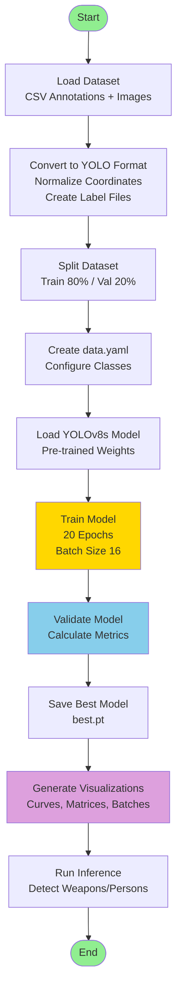
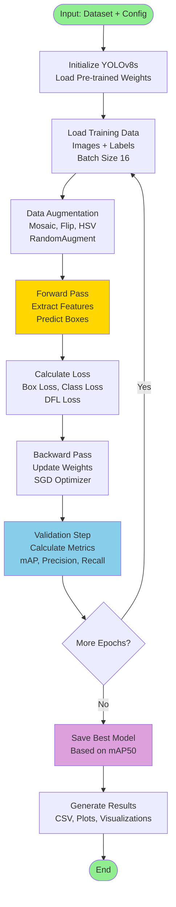
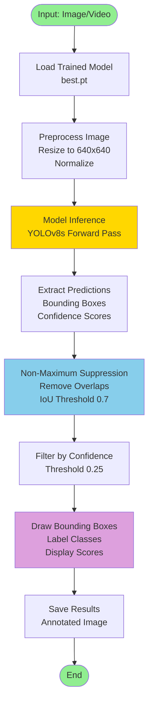

# Gun Detection

A deep learning application for detecting weapons and persons in surveillance footage using YOLO (You Only Look Once) object detection. This project uses YOLOv8s for real-time weapon detection and provides comprehensive training metrics, visualizations, and pre-trained models.

## Features

- **YOLO-Based Object Detection**: Uses YOLOv8s architecture for fast and accurate object detection
- **Dual-Class Detection**: Detects both persons and weapons in surveillance footage
- **Comprehensive Training Metrics**: Provides detailed performance metrics including precision, recall, mAP, and confusion matrices
- **Visualization Tools**: Generates training curves, confusion matrices, precision-recall curves, and batch visualizations
- **Pre-trained Models**: Includes trained model checkpoints ready for inference
- **YOLO Format Dataset**: Properly formatted dataset with train/validation splits
- **Real-time Capable**: Optimized for real-time inference on surveillance systems

## Architecture Overview

The system consists of three main components:

1. **Data Processing Module**: Converts raw annotations to YOLO format and splits data into training/validation sets
2. **Model Training Engine**: Trains YOLOv8s model with configurable hyperparameters and data augmentation
3. **Evaluation and Visualization**: Generates comprehensive metrics and visualizations for model performance analysis

## Workflow

### Main System Workflow



### Training Process



### Inference Process



## Installation

### Prerequisites

- Python 3.8 or higher
- CUDA-capable GPU (optional, for faster training and inference)
- pip package manager

### Installation Steps

1. **Install Ultralytics YOLO**:
   ```bash
   pip install ultralytics
   ```

2. **Install Additional Dependencies** (if using the notebook):
   ```bash
   pip install pandas scikit-learn tqdm matplotlib
   ```

3. **Verify Installation**:
   ```python
   from ultralytics import YOLO
   print("YOLO installed successfully!")
   ```

## Usage

### Training the Model

The training process is documented in the Jupyter notebook `gun-detection.ipynb`. Here's a summary of the key steps:

#### 1. Data Preparation

Convert your dataset from CSV format to YOLO format:

```python
import pandas as pd
import os
import shutil
from sklearn.model_selection import train_test_split

# Configuration
csv_path = 'path/to/annotations.csv'
source_img_dir = 'path/to/images'
output_dir = 'Yolo/data'

# Class mapping
class_map = {
    'person': 0,
    'weapon': 1
}

# Create directories
for split in ['train', 'val']:
    for kind in ['images', 'labels']:
        os.makedirs(os.path.join(output_dir, split, kind), exist_ok=True)

# Process and convert to YOLO format
# (See notebook for complete code)
```

#### 2. Create Data Configuration

Create `data.yaml` file:

```python
import yaml

data_config = {
    'path': 'Yolo/data',
    'train': 'train/images',
    'val': 'val/images',
    'nc': 2,
    'names': ['person', 'weapon']
}

with open('Yolo/data/data.yaml', 'w') as f:
    yaml.dump(data_config, f)
```

#### 3. Train the Model

```python
from ultralytics import YOLO

# Load pre-trained YOLOv8s model
model = YOLO('yolov8s.pt')

# Train the model
results = model.train(
    data='Yolo/data_fixed.yaml',
    project='Yolo/training_results',
    name='weapon_detection',
    epochs=20,
    imgsz=640,
    batch=16,
    patience=10,
    save=True,
    exist_ok=True,
    pretrained=True,
    optimizer='auto',
    verbose=True,
    seed=42
)
```

### Running Inference

#### Single Image Inference

```python
from ultralytics import YOLO

# Load trained model
model = YOLO('Yolo/best.pt')

# Run inference
results = model('path/to/image.jpg')

# Display results
results[0].show()

# Save results
results[0].save('output.jpg')
```

#### Video Inference

```python
# Run inference on video
results = model('path/to/video.mp4')

# Save annotated video
results[0].save('output_video.mp4')
```

#### Batch Inference

```python
# Process multiple images
results = model(['image1.jpg', 'image2.jpg', 'image3.jpg'])

for i, result in enumerate(results):
    result.save(f'output_{i}.jpg')
```

### Using the Notebook

1. Open `gun-detection.ipynb` in Jupyter Notebook or Google Colab
2. Run cells sequentially:
   - Cell 0: Install Ultralytics
   - Cell 1: Import YOLO
   - Cell 2: Data preparation and conversion
   - Cell 3: Create data configuration
   - Cell 4: Train the model
   - Cell 5: Visualize results

## Code Structure

### Main Functions

#### Data Preparation (`process_dataset`)

Converts CSV annotations to YOLO format and splits data into training/validation sets.

**Process:**
1. Reads CSV file with bounding box annotations
2. Normalizes coordinates to YOLO format (0-1 range)
3. Splits images into train/val sets (80/20 split)
4. Creates label files (.txt) for each image
5. Copies images to appropriate directories

**YOLO Format:**
```
class_id x_center y_center width height
```
All values are normalized between 0 and 1.

#### Model Training (`model.train`)

Trains YOLOv8s model with configurable hyperparameters.

**Key Parameters:**
- `data`: Path to data configuration YAML file
- `epochs`: Number of training epochs (default: 20)
- `imgsz`: Input image size (default: 640)
- `batch`: Batch size (default: 16)
- `patience`: Early stopping patience (default: 10)
- `optimizer`: Optimizer type (default: 'auto' - SGD)

#### Results Visualization

The notebook includes code to visualize training results:

```python
import matplotlib.pyplot as plt
import matplotlib.image as mpimg
import os

results_dir = 'Yolo/training_results/weapon_detection'

# Collect and display all visualization files
# Includes: results.png, confusion matrices, curves, batch images
```

## Output Files

### Training Results Directory

After training, the following files are generated in `Yolo/training_results/weapon_detection/`:

#### Metrics Files
- **`results.csv`**: Training metrics for each epoch (loss, precision, recall, mAP)
- **`results.png`**: Training curves visualization (8 subplots showing all metrics)
- **`args.yaml`**: Training configuration and hyperparameters

#### Confusion Matrices
- **`confusion_matrix.png`**: Raw confusion matrix with counts
- **`confusion_matrix_normalized.png`**: Normalized confusion matrix with percentages

#### Performance Curves
- **`BoxF1_curve.png`**: F1 score vs confidence threshold
- **`BoxPR_curve.png`**: Precision-Recall curve
- **`BoxP_curve.png`**: Precision vs confidence threshold
- **`BoxR_curve.png`**: Recall vs confidence threshold

#### Batch Visualizations
- **`val_batch0_pred.jpg`**: Validation batch with model predictions
- **`val_batch0_labels.jpg`**: Validation batch with ground truth labels
- **`train_batch*.jpg`**: Training batch visualizations

#### Dataset Analysis
- **`labels.jpg`**: Dataset statistics including:
  - Class distribution (bar chart)
  - Bounding box center distribution (scatter plot)
  - Bounding box size distribution (scatter plot)
  - Aspect ratio visualization

#### Model Weights
- **`weights/best.pt`**: Best model checkpoint (based on mAP50)
- **`weights/last.pt`**: Last epoch model checkpoint

## Technical Details

### Model Architecture

**YOLOv8s (Small Variant)**
- Backbone: CSPDarknet53 with cross-stage partial connections
- Neck: PANet (Path Aggregation Network)
- Head: Decoupled head with separate classification and regression branches
- Input size: 640×640 pixels
- Output: Bounding boxes with class predictions and confidence scores
- Classes: 2 (person, weapon)

### Image Preprocessing

1. **Resize**: All images resized to 640×640 pixels (maintaining aspect ratio with padding)
2. **Normalization**: ImageNet mean/std normalization
   - Mean: [0.485, 0.456, 0.406]
   - Std: [0.229, 0.224, 0.225]
3. **Data Augmentation** (during training):
   - Mosaic augmentation (probability: 1.0)
   - Horizontal flip (probability: 0.5)
   - HSV augmentation (hue: ±0.015, saturation: ±0.7, value: ±0.4)
   - RandomAugment
   - Translation (±10%)
   - Scaling (0.5-1.5x)
   - Copy-paste augmentation

### Post-Processing

1. **Non-Maximum Suppression (NMS)**:
   - IoU threshold: 0.7
   - Removes overlapping detections
   - Keeps highest confidence boxes

2. **Confidence Filtering**:
   - Default threshold: 0.25
   - Filters out low-confidence predictions

3. **Box Format Conversion**:
   - Converts from center format to corner format for visualization
   - Applies to original image dimensions

### Training Hyperparameters

**Optimizer:**
- Type: SGD (Stochastic Gradient Descent)
- Initial learning rate (lr0): 0.01
- Final learning rate (lrf): 0.01
- Momentum: 0.937
- Weight decay: 0.0005

**Learning Rate Schedule:**
- Warmup epochs: 3.0
- Warmup momentum: 0.8
- Warmup bias learning rate: 0.1

**Loss Functions:**
- Box loss weight: 7.5
- Class loss weight: 0.5
- DFL (Distribution Focal Loss) weight: 1.5

**Training Configuration:**
- Epochs: 20
- Batch size: 16
- Image size: 640×640
- Workers: 8 (data loading threads)
- Early stopping patience: 10 epochs
- Mixed precision training (AMP): Enabled

### Evaluation Metrics

The model is evaluated using standard object detection metrics:

- **Precision**: Ratio of true positives to all positive predictions
- **Recall**: Ratio of true positives to all ground truth objects
- **mAP50**: Mean Average Precision at IoU threshold 0.5
- **mAP50-95**: Mean Average Precision averaged over IoU thresholds 0.5 to 0.95 (step 0.05)
- **F1 Score**: Harmonic mean of precision and recall

## Dataset Information

### Dataset Structure

```
Yolo/data/
├── train/
│   ├── images/     # 112 training images
│   └── labels/     # 112 label files (.txt)
├── val/
│   ├── images/     # 29 validation images
│   └── labels/     # 29 label files (.txt)
└── data.yaml       # Dataset configuration
```

### Class Distribution

- **Person**: 111 instances (training set)
- **Weapon**: 106 instances (training set)
- **Total Images**: 141 (112 train, 29 val)
- **Train/Val Split**: 80/20

### Data Format

**YOLO Label Format** (`.txt` files):
```
class_id x_center y_center width height
```

Example:
```
0 0.512345 0.623456 0.123456 0.234567
1 0.345678 0.456789 0.098765 0.187654
```

Where:
- `class_id`: 0 for person, 1 for weapon
- All coordinates are normalized (0.0 to 1.0)
- `x_center, y_center`: Center coordinates of bounding box
- `width, height`: Width and height of bounding box

### Dataset Characteristics

- **Source**: CCTV/surveillance footage
- **Scenes**: Multiple indoor and outdoor environments
- **Camera Types**: Various (including fisheye lenses)
- **Environments**: Hallways, parking lots, gas stations, street scenes
- **Image Format**: PNG files
- **Annotation Format**: YOLO format (normalized coordinates)

## Model Performance

### Final Training Metrics (Epoch 20)

Based on the training results:

- **Precision**: 0.97328 (97.3%)
- **Recall**: 0.8763 (87.6%)
- **mAP50**: 0.9334 (93.3%)
- **mAP50-95**: 0.61706 (61.7%)
- **F1 Score**: ~0.92 (at optimal confidence threshold)

### Confusion Matrix Analysis

**Normalized Confusion Matrix:**
- **Person → Person**: 96% (high accuracy)
- **Person → Weapon**: 1% (low false positive)
- **Person → Background**: 3%
- **Weapon → Weapon**: 95% (high accuracy)
- **Weapon → Person**: 2% (low confusion)
- **Weapon → Background**: 3%
- **Background → Background**: 82%

### Performance Curves

The training generates several performance curves:

1. **F1-Confidence Curve**: Shows optimal confidence threshold (~0.66) for maximum F1 score (0.90)
2. **Precision-Recall Curve**: Demonstrates precision-recall trade-off (mAP: 0.922)
3. **Precision-Confidence Curve**: Shows precision increases with confidence threshold
4. **Recall-Confidence Curve**: Shows recall decreases with confidence threshold

### Training Progress

The model shows consistent improvement over 20 epochs:
- Loss values decrease steadily (box loss: 1.56 → 0.89, class loss: 5.10 → 0.64)
- Precision increases from 9.75% to 97.33%
- Recall increases from 5.63% to 87.63%
- mAP50 improves from 3.81% to 93.34%

## Project Structure

```
Gun_Detection/
│
├── README.md                    # This file
├── gun-detection.ipynb          # Main training notebook
├── __results___5_0.png          # Training results visualization
│
├── Yolo/
│   ├── best.pt                  # Best trained model (21MB)
│   ├── yolov8s.pt               # Pre-trained YOLOv8s weights (22MB)
│   ├── yolo11n.pt               # YOLO11 nano weights (5.4MB)
│   ├── data_fixed.yaml          # Fixed data configuration
│   │
│   ├── data/
│   │   ├── data.yaml            # Dataset configuration
│   │   ├── train/
│   │   │   ├── images/          # 112 training images
│   │   │   └── labels/          # 112 label files
│   │   └── val/
│   │       ├── images/          # 29 validation images
│   │       └── labels/          # 29 label files
│   │
│   └── training_results/
│       └── weapon_detection/
│           ├── args.yaml        # Training configuration
│           ├── results.csv      # Training metrics
│           ├── results.png      # Training curves
│           ├── confusion_matrix.png
│           ├── confusion_matrix_normalized.png
│           ├── BoxF1_curve.png
│           ├── BoxPR_curve.png
│           ├── BoxP_curve.png
│           ├── BoxR_curve.png
│           ├── labels.jpg       # Dataset statistics
│           ├── val_batch0_pred.jpg
│           ├── val_batch0_labels.jpg
│           ├── train_batch*.jpg
│           └── weights/
│               ├── best.pt      # Best model checkpoint
│               └── last.pt      # Last epoch checkpoint
```

## Troubleshooting

### Model File Not Found

**Issue**: `FileNotFoundError` when loading model

**Solution**:
- Ensure model files (`.pt`) are in the `Yolo/` directory
- Check file paths in your code
- Download pre-trained weights if missing:
  ```python
  from ultralytics import YOLO
  model = YOLO('yolov8s.pt')  # Downloads automatically
  ```

### Dataset Path Issues

**Issue**: YOLO cannot find training images

**Solution**:
- Verify `data.yaml` paths are correct
- Use absolute paths in `data_fixed.yaml`
- Ensure directory structure matches YOLO format:
  ```
  data/
  ├── train/images/
  ├── train/labels/
  ├── val/images/
  └── val/labels/
  ```

### CUDA Out of Memory

**Issue**: `RuntimeError: CUDA out of memory`

**Solution**:
- Reduce batch size (e.g., `batch=8` or `batch=4`)
- Reduce image size (e.g., `imgsz=416`)
- Use CPU (slower but works):
  ```python
  model.train(..., device='cpu')
  ```

### Low Detection Accuracy

**Issue**: Model not detecting weapons accurately

**Solution**:
- Check dataset quality and annotation accuracy
- Increase training epochs
- Adjust confidence threshold:
  ```python
  results = model('image.jpg', conf=0.25)  # Lower threshold
  ```
- Use data augmentation (already enabled by default)
- Consider using larger model variant (YOLOv8m, YOLOv8l)

### Import Errors

**Issue**: `ModuleNotFoundError: No module named 'ultralytics'`

**Solution**:
```bash
pip install ultralytics
```

For additional dependencies:
```bash
pip install pandas scikit-learn tqdm matplotlib
```

### Training Stops Early

**Issue**: Training stops before reaching max epochs

**Solution**:
- Check `patience` parameter (early stopping)
- Increase `patience` value or set to `None` to disable:
  ```python
  model.train(..., patience=None)
  ```

## License

This project is for research and educational purposes. Please ensure compliance with local regulations regarding weapon detection systems and surveillance data handling.

## Contributing

Contributions are welcome! Please ensure:
- Code follows existing style and conventions
- Documentation is updated for new features
- Tests are added for new functionality
- Training results are validated before committing

## Acknowledgments

- **Ultralytics** for the YOLOv8 framework and pre-trained models
- **PyTorch** team for the deep learning framework
- **CCTV Weapon Dataset** contributors for the training data
- Open source computer vision community for tools and resources

## References

- [Ultralytics YOLO Documentation](https://docs.ultralytics.com/)
- [YOLOv8 Paper](https://arxiv.org/abs/2305.09972)
- [YOLO: You Only Look Once](https://arxiv.org/abs/1506.02640)

